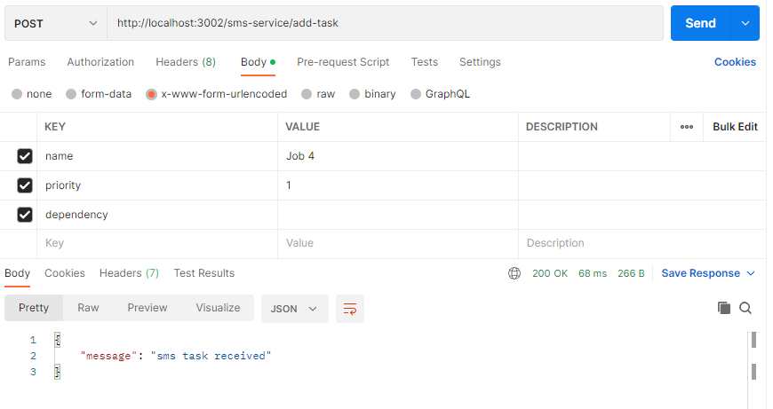

# Job Scheduler

This Job scheduler consists of 3 microservices which are created in `mail`, `sms` and `scheduler` folders respectively.

## How to run locally

1.  - Start TiDB playground using `tiup playground`.
    - By default the service connects to MySQL localhost at port 4000, with user 'root' and no password.
    - Default database used is `test`, create it if it doesn't exist
    - Or provide your own ENV variable called `MYSQL_URL`.

2.  - Start Rabbit MQ using Docker image: `docker run -it --rm --name rabbitmq -p 5672:5672 -p 15672:15672 rabbitmq:3.11-management
`
    - Services will connect to port 5672 at localhost.
3.  Run the commands `npm install` and `npm start` inside all 3 folders: mail, sms and scheduler.
4. gRPC service will run at `http://127.0.0.1:50051` so make sure that port is free.

## Usage

### __Mail service__

- Mail service runs at `http://localhost:3001` by default.
- To add a task send a POST request at `/mail-service/add-task`
- The body should have the following fields (validated using Joi):
    1. `name` (required, must be a string)
    2. `priority` (required, valid values are: 'High', 'Medium', 'Low' or 1, 2 & 3 respectively)
    3. `dependency` (not required, but must be a number or an empty string if present) - Additionally, dependency works by ID, which are auto-incremented in the SQL schema, so ensure you are providing a value which is less than the current tasks's ID, since tasks can only depend on other tasks which have a time_stamp earlier than their own.

- `time_stamp`, `type` and `id` will be automatically added to a task by the service.
- To see the list of scheduled mail tasks send a GET request at `/mail-service/get-scheduled-mail` (this works via gRPC connection between the service and the scheduler)

### __SMS service__

- SMS service runs at `http://localhost:3002` by default.
- To add a task send a POST request at `/sms-service/add-task`
- The body should have the following fields (validated using Joi):
    1. `name` (required, must be a string)
    2. `priority` (required, valid values are: 'High', 'Medium', 'Low' or 1, 2 & 3 respectively)
    3. `dependency` (not required, but must be a number or an empty string if present) - Additionally, dependency works by ID, which are auto-incremented in the SQL schema, so ensure you are providing a value which is less than the current tasks's ID, since tasks can only depend on other tasks which have a time_stamp earlier than their own.

- `time_stamp`, `type` and `id` will be automatically added to a task by the service.
- To see the list of scheduled mail tasks send a GET request at `/sms-service/get-scheduled-sms` (this works via gRPC connection between the service and the scheduler)

### __Scheduler service__

- Scheduler service runs at `http://localhost:3003` by default.
- Make a GET request at `/get_schedule` to fetch the current schedule. The schedule is updated after adding every new task and maintained in a Redis queue.

## Screenshots
The screenshots are of the test case as described in the assignment pdf.

| Mail service inputs     | SMS service inputs |
| ----------- | ----------- |
|Job 1, Priority 2, time stamp: 12:37, dep: nil    |        |
|  | Job 2, Priority 2, time stamp: 12:38, dep: nil  |
| Job 3, Priority 1, time stamp: 12:39, dep: Job 1 | |
||Job 4, Priority 1, time stamp: 12:39, dep: nil|

